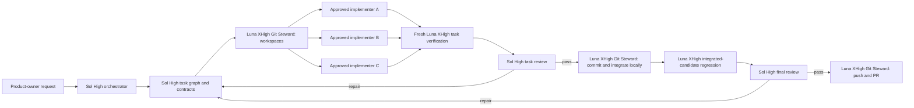
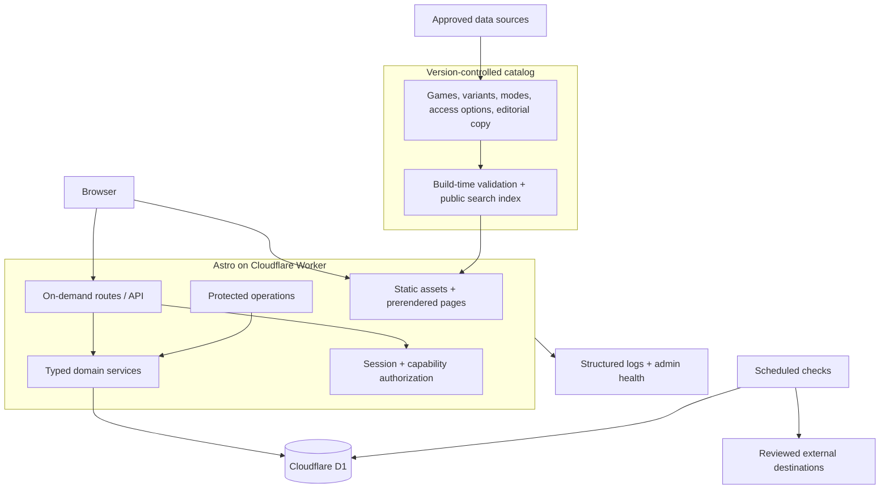

# Game Portal — Architecture and Delivery Plan

**Status:** Approved technical direction, refined for current platform guidance  
**Team:** One product owner/developer directing an orchestrated AI team through GPT5.6-Sol High  
**Cost constraint:** Free resources only  
**Repository target:** `AkshayMantri/GamePortal`

# Recommended architecture

## Stack

- Astro 6+ with TypeScript.
- React only as hydrated islands for interactions that need client state.
- Cloudflare Workers deployment with static assets and on-demand routes.
- Cloudflare D1 for mutable relational data.
- Version-controlled JSON/YAML or Astro content collections for the approximately 20 curated Games.
- GitHub for source control and CI within available free allowances.
- `pnpm` is the recommended package manager for efficient local storage and reproducible lockfiles.
- No paid authentication, email, analytics, search, media, or job provider.

## Current-platform correction

Current Astro Cloudflare documentation states that the Astro 6 Cloudflare adapter no longer supports the former Cloudflare Pages deployment path for on-demand applications and recommends Cloudflare Workers. The application should therefore deploy as a Worker with static assets. Static requests remain inexpensive and do not need to invoke dynamic logic when routed correctly.

Sources:

- https://docs.astro.build/en/guides/integrations-guide/cloudflare/
- https://docs.astro.build/en/guides/deploy/cloudflare/
- https://developers.cloudflare.com/workers/platform/limits/
- https://developers.cloudflare.com/d1/platform/limits/

# Why this fits

- The small curated catalog can be built into static pages and a compact client-side index.
- Find and Browse can run locally in the browser for the initial 20 games.
- Dynamic infrastructure is reserved for votes, accounts, events, link observations, analytics, and aggregates.
- Static Game Pages remain readable during a dynamic-service outage.
- One repository and one deployment surface reduce solo operational burden.
- A Sol High orchestrator can parallelize bounded implementation while retaining one authoritative plan and independent verification.
- D1 provides transactions and indexes for capacity, votes, and account relationships.
- Free-tier quotas remain visible and bounded.

## Most important tradeoff

The architecture favors deliberate bounded scale and operational simplicity over unlimited real-time behavior. If activity grows beyond free limits, the product must either reduce dynamic work, introduce stricter quotas, or seek a new cost decision; it must not silently incur paid usage.

## Agent execution architecture

The repository uses the operating contract in `AGENTS.md`. Agent orchestration is part of delivery architecture because it determines ownership, verification independence, integration risk, and the reliability of changes produced by a one-person team.

| Lane | Model | Responsibility |
|---|---|---|
| Orchestrator and all planning | **Sol High** | Intake, repository/context analysis, architecture, task graph, contracts, risk assessment, synthesis, remediation planning, final review |
| Routine implementation | **Terra High** or **Sol Medium** | Small or standard changes with frozen contracts and narrow file ownership |
| Complex implementation | **Terra XHigh** or **Sol High** | Cross-layer, data, authentication, concurrency, security, accessibility, or integration-heavy work |
| Verification-heavy implementation | **Luna XHigh** in an implementer context | Test infrastructure or difficult bug/security fixes; cannot test its own work |
| Formal tester | Fresh **Luna XHigh** | Independently executes the Sol High test charter, adds adversarial/regression cases, performs browser/accessibility/security verification, and reports exact results |
| Git Steward | Separate fresh **Luna XHigh** | Every `git`, `gh`, branch/worktree, commit, push, PR, check, and GitHub action |

### Execution flow

Default implementation concurrency is at most three agents and only after shared schemas/contracts are frozen. Authentication, migrations, event-capacity logic, vote-result contracts, dependency changes, and shared generated files remain serialized.

### Why role separation matters

- The orchestrator cannot hide planning drift inside implementation.
- Implementers cannot declare their own work accepted.
- The tester executes the Sol High-owned charter independently and adds adversarial checks rather than mirroring implementer assumptions.
- Git delivery cannot bypass task-level testing, integrated regression, final review, or accidentally stage unrelated user work.
- A single product owner receives one synthesized result instead of incompatible subagent conclusions.

# Component architecture

# Static and dynamic ownership

## Version-controlled catalog

Use repository files as the editorial source of truth for:

- Game,
- Edition/Variant,
- Play Mode,
- baseline Access Option definitions,
- requirements,
- original descriptions,
- source claims,
- media manifests,
- reviewed destination definitions,
- curated type/tag taxonomy.

A build-time schema validates every record. Publication changes require review and deployment, which is appropriate for approximately 20 games.

## D1 mutable data

Use D1 for:

- account and passkey credentials,
- sessions and recovery codes,
- favorites, recents, and played records,
- vote sessions, passes, ballots, results,
- Game Night events and participant capabilities,
- link-health observations and current status,
- reports, moderation actions, audit entries,
- minimal product events and daily Popular aggregates,
- recommendation hides/reset state.

Game IDs and Access Option IDs are stable application IDs shared between static data and D1.

# Rendering and SEO

- Prerender Browse, Find shell, Game Pages, safety/policy pages, and non-personal editorial content.
- Use on-demand routes for private Library/account state, vote/session views, events with current capacity, and operations.
- Use canonical URLs, structured metadata, Open Graph metadata, and game-specific titles where rights permit.
- Do not index private vote capabilities, joined event details, account pages, admin routes, or URLs containing secrets.
- Static Game Pages fetch small dynamic status fragments only when needed; stale status is acceptable and labeled.

# Client architecture

React islands only for:

- party-size and filter state,
- Random draw history,
- ranked ballot interaction,
- vote status polling,
- account/passkey UI,
- Library mutations,
- Game Night join/leave/status,
- QR rendering where client generation is used.

Prefer Astro/server-rendered HTML for navigation, content, cards, and initial state. Avoid hydrating entire pages.

# Search and filtering

## Initial release

- Build a compact public JSON index from validated catalog files.
- Filter in the browser for approximately 20 games.
- Run the exact same pure TypeScript matching functions at build/test time and in the client.
- Keep ranking deterministic.
- Do not add an external search service.

## Later pressure point

Move search/filter queries to D1 or a dedicated service only when catalog size, private data, bundle size, or observed performance warrants it. A migration must preserve exact/unknown/near semantics.

# Authentication and guest capabilities

## Accounts

Recommended account mechanism:

- WebAuthn/passkeys.
- Account age affirmation of 18+.
- Downloadable single-use recovery codes stored hashed.
- No password database.
- No paid email provider.
- Session IDs stored hashed in D1 and delivered in secure, HttpOnly, SameSite cookies.
- Session rotation on authentication and sensitive changes.

This mechanism remains an implementation recommendation until browser usability testing passes.

## Guests

Use high-entropy signed or server-stored capability tokens for:

- voter passes,
- joined-event details,
- 13+ guest participation.

Do not put raw secrets in analytics or logs. Tokens may appear in a URL only when necessary and should be exchanged for an HttpOnly cookie, then removed from the visible URL.

Under-13 participation is adult-mediated and does not create a child capability or account.

# Near-real-time behavior

Use versioned polling rather than WebSockets:

- 2–3 seconds while the relevant page is visible.
- Pause in background tabs.
- Conditional request/version number prevents unchanged payloads.
- Exponential backoff on errors.
- Announce only material user-relevant changes.
- Vote and seat writes are ordinary idempotent HTTP mutations.

This is simpler and sufficient for small social sessions.

# Data consistency

- Event capacity uses a D1 transaction or atomic conditional write.
- Active participation is unique per event/actor capability.
- Vote closure is transactional and idempotent.
- Candidate set freezes before ballots are accepted.
- Popular aggregation is idempotent by date/window.
- Background jobs use deterministic job keys.
- User/library writes use idempotency keys where repeat submission is plausible.

# Background work

Cloudflare Free permits limited Cron Triggers and bounded Worker requests. Use one or two schedules:

1. Daily or twice-daily link checks for the small reviewed destination set.
2. Daily aggregation and retention cleanup.

Link checks must remain below provider and Worker subrequest limits. Manual recheck is available in operations. Do not use a headless browser by default; reserve any limited browser check for reviewed high-value providers and free allowance.

# Link-health checker

- Allow only `https` and explicitly reviewed `http` exceptions.
- Reject embedded credentials.
- Resolve and reject loopback, private, link-local, metadata, and internal ranges.
- Revalidate every redirect target.
- Bound redirects, response bytes, and time.
- Attempt `HEAD`, then bounded `GET` where needed.
- Store observations; do not overwrite history.
- Require repeated/transparently reviewed failure before retiring an option.
- Describe success as a recent response, not a guarantee of playability.

# QR generation

- Generate SVG locally or server-side using a small audited library.
- Default QR points to the canonical Game Page.
- Access Option QR is separately labeled and generated only for a reviewed option.
- No tracking parameters by default.
- Include a visible fallback URL.

# Media

- Prefer local, licensed, build-time optimized images.
- Neutral placeholders are first-class.
- Official video embeds are click-to-load with a privacy/provider disclosure.
- Do not proxy or store media without permission.
- Reserve intrinsic dimensions.

# Analytics and Popular

- First-party event endpoint.
- Signed guest session ID, rotated and short-lived; no cross-site identifier.
- Do not store full IP addresses or user agents beyond immediate security need.
- Deduplicate qualifying events per game/day/actor.
- Aggregate daily.
- Purge raw product events after a short period, recommended 30 days.
- Popular reads aggregate tables, not raw events.
- Sample count is part of the public contract.

# Recommendations

A pure content-based/rule-based service reads catalog features and local/account Library activity.

- Guest recommendations can be computed client-side.
- Account recommendations may be computed on request using bounded D1 reads.
- Cache only non-sensitive derived results briefly.
- No external ML or embedding service.
- Explanation is generated from explicit matching features, not a language model.

# Administration and moderation

Protected operations are part of the same application:

- catalog review status,
- source/rights validation,
- link observations and manual override,
- report queue,
- event cancellation/removal,
- audit log,
- health/quota summary,
- data export/deletion queue.

Roles:

- editor,
- reviewer,
- rights operator,
- link operator,
- moderator,
- administrator.

For a solo operator, one account may hold all roles, but code must still enforce explicit permissions and audit high-risk actions.

# Free-tier operational envelope

As of 2026-07-16, official Cloudflare documentation lists:

- Workers Free: 100,000 requests/day, 10 ms CPU per HTTP request, 128 MB memory, 50 external subrequests per invocation, and 5 Cron Triggers.
- Workers static assets: 20,000 files and 25 MiB per file on Free.
- D1 Free: 10 databases, 500 MB per database, 5 GB account storage, and 7-day Time Travel.

These limits can change and must be rechecked before implementation and launch.

The architecture protects the envelope by:

- serving catalog pages as static assets,
- filtering the small catalog client-side,
- polling only on active session pages,
- aggregating analytics,
- retaining raw data briefly,
- indexing D1 queries,
- preventing unbounded event/list endpoints,
- limiting link checks.

# Caching

- Immutable hashed assets: long-lived cache.
- Static Game Pages: deployment-version cache.
- Public catalog index: deployment-version cache.
- Dynamic event/vote status: no-store or short conditional cache.
- Popular aggregates: short public cache after daily build.
- Private Library/account responses: private/no-store.
- Never cache responses containing capability secrets in shared caches.

# Backups and portability

- Catalog and planning files: Git history.
- D1: documented manual and automated export where free allowances permit.
- Weekly export target plus pre-migration export.
- D1 Time Travel is a short recovery layer, not the only backup.
- Restore drill before launch.
- User export in documented JSON.
- Stable application IDs avoid vendor IDs as primary identity.

# Testing strategy

Formal verification is owned by **Luna XHigh** under a Sol High-authored test charter. Implementers may run focused self-checks, but their results do not replace independent acceptance. Verification occurs twice: task-level before integration and on the integrated candidate before push/PR delivery. Sol High owns the test plan and both task and final cross-disciplinary reviews.

## Pure domain tests

- matching truth tables,
- time boundaries,
- requirement quantity/scope,
- Borda and partial ballots,
- tie chain,
- random uniformity/no-repeat,
- popularity deduplication,
- event state transitions,
- retention rules.

## Integration tests

- D1 migrations and indexes,
- passkey registration/sign-in/recovery,
- session rotation,
- vote token lifecycle,
- concurrent final-seat join,
- link-check SSRF cases,
- export/deletion,
- moderation authorization.

## End-to-end

- Find exact and no-result recovery.
- Browse to Game Page.
- Random exhaustion.
- Complete guest Vote.
- Account/local Library merge.
- Popular one-signal disclosure.
- Remote and public-venue Game Night creation/join/cancel/report.
- Unauthorized private detail access.
- Offline static Game Page.

## Accessibility and performance

- Automated checks plus manual keyboard/screen-reader review.
- 390/tablet/1024/1440.
- 200% zoom, reflow, reduced motion, forced colors.
- Core Web Vitals measurement.
- No unbounded hydration or layout shift.

# Deployment and CI

Every Git/GitHub action in this workflow is performed by the dedicated **Luna XHigh Git Steward**. Other agents may edit assigned filesystem workspaces and run non-Git project commands, but they do not inspect diffs, create branches, commit, push, or operate pull requests.

Recommended pipeline:

1. format/lint,
2. type check,
3. unit tests,
4. build-time catalog validation,
5. integration tests against local D1,
6. Astro build,
7. accessibility smoke tests,
8. deploy preview,
9. manual approval for production.

Do not use production secrets in pull requests. GitHub and Cloudflare credentials remain in platform secret stores. Generated lockfiles are changed only through the package manager.

# Scaling pressure points

| Pressure | First response |
|---|---|
| Catalog grows beyond easy client filtering | Move filter/search to indexed D1 while preserving pure matching contract |
| Vote/event polling grows | Increase backoff, conditional responses, then evaluate SSE/Durable Objects |
| Analytics rows grow | Shorter raw retention and stronger daily aggregation |
| Link checks exceed one bounded run | Partition schedules and provider adapters |
| D1 row reads approach free quota | Add indexes, keyset pagination, precomputed views |
| Moderation volume exceeds solo capacity | Limit event creation, pause public events, or obtain operational support |
| Free-tier request limit is reached | Static fallback and explicit service-unavailable state; no surprise billing |
