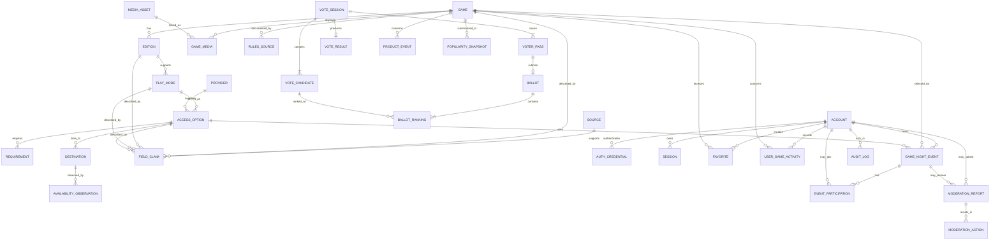

# Game Portal — Conceptual Data Model

This document defines entity ownership, invariants, retention, and indexing. It is not a production migration.

# Storage split

## Version-controlled catalog

- Game
- Edition/Variant
- Play Mode
- baseline Access Option
- Requirement
- Destination definition
- original editorial content
- source claims
- media and rules manifests

## D1 mutable state

- current Access Option publication/status override
- Availability Observation
- Account, credential, session, recovery code
- Library activity
- Vote entities
- Event entities
- Product events and Popular aggregates
- Report, moderation action, audit log
- deletion/export requests

# Entity relationship diagram



# Catalog entities

## Game

Key fields:

- `id`: stable opaque application ID.
- `slug`: unique public path segment.
- `canonical_title`.
- `sort_title`.
- `game_type`.
- `summary_original`.
- `publication_status`.
- `content_updated_at`.

Invariants:

- Slug is stable after publication except through a redirect migration.
- Summary is original or explicitly licensed.
- A published Game has at least one published Edition, Play Mode, and Access Option.

## Edition/Variant

- `id`
- `game_id`
- `title`
- `variant_kind`
- `publisher_or_tradition`
- `recommended_min_age`
- `age_guidance_kind`
- `language_tags`
- `region_notes`

A traditional game may use an editorially defined rules variant rather than a commercial edition.

## Play Mode

- `id`
- `edition_id`
- `mode`: in_person | remote
- `synchrony`: synchronous | asynchronous
- `players_min`
- `players_max`
- optional explicit supported-count set
- `setup_minutes`
- `teach_minutes`
- `play_minutes_min`
- `play_minutes_max`
- `team_structure`

Use an explicit supported-count set when a range would be misleading.

## Access Option

- `id`
- `play_mode_id`
- `provider_id`
- `access_kind`: physical_instructions | browser | mobile_app | desktop_app | console | store | other
- `account_requirement`
- `installation_requirement`
- `price_classification`
- `region_allowlist` / `region_blocklist`
- `language_tags`
- `publication_status`
- `availability_policy`
- `destination_id`

An Access Option may override player/time fields only when the provider adaptation differs from its Play Mode baseline.

## Requirement

- `id`
- `access_option_id`
- `requirement_type`
- `item_code`
- `minimum_quantity`
- `scope`: per_group | host_only | per_person | per_team
- `mandatory`
- `notes`

## Destination

- `id`
- `provider_id`
- `url`
- `destination_type`
- `review_status`
- `reviewed_at`
- `redirect_policy`
- `public_display_domain`

Destination URLs are never accepted directly from ordinary users in the first release.

## Availability Observation

Append-only:

- `id`
- `destination_id`
- `checked_at`
- `method`
- `http_status`
- `final_url`
- `classification`
- `confidence`
- `latency_ms`
- `error_code`
- `operator_note`

A separate current-status projection may point to the latest qualifying observation or manual override.

# Provenance

## Source

- `id`
- `name`
- `source_type`
- `canonical_url`
- `license_or_permission`
- `attribution_text`
- `terms_reviewed_at`
- `contact`
- `active`

## Field Claim

- `id`
- `entity_type`
- `entity_id`
- `field_path`
- `normalized_value_hash`
- `source_id`
- `source_locator`
- `source_updated_at`
- `retrieved_at`
- `license_or_permission`
- `verification_status`
- `confidence`
- `reviewed_by`
- `reviewed_at`
- `supersedes_claim_id`

Field provenance permits a player count, image, and rules link to have different sources and rights.

## Media Asset

- `id`
- `asset_kind`
- `storage_kind`: local | external_embed | external_reference
- `source_id`
- `rights_basis`
- `attribution`
- `expiry_at`
- `alt_text`
- `intrinsic_width/height`
- `publication_status`

# Accounts and Library

## Account

- `id`
- `display_name`
- `age_affirmed_18_plus_at`
- `created_at`
- `status`
- `deletion_requested_at`
- `deleted_at`

Do not store birth date.

## Auth Credential

For passkeys:

- `id`
- `account_id`
- `credential_id`
- `public_key`
- `sign_count`
- `transports`
- `created_at`
- `last_used_at`
- `revoked_at`

## Session

- hashed session token,
- account ID,
- created/last-used/expiry,
- rotation lineage,
- revoked time,
- security metadata minimized and retention-bounded.

## Favorite

Unique `(account_id, game_id)`.

## User Game Activity

- `activity_kind`: viewed | played | hidden_recommendation
- `game_id`
- `access_option_id` optional
- `occurred_at`
- `source`
- `deleted_at`

View activity is capped to the last 30 distinct Games in 90 days. Played is explicit.

Guest Library remains in local storage unless the user confirms a merge.

# Vote

## Vote Session

- `id`
- `host_capability_hash` or `host_account_id`
- `state`
- `expected_voter_count`
- `candidate_count`
- `opened_at`
- `closed_at`
- `expires_at`
- `algorithm_version`
- `result_id`

## Candidate

- `id`
- `vote_session_id`
- `position`
- `label`
- `game_id` optional
- `normalized_label`

Unique normalized label within session.

## Voter Pass

- `id`
- `vote_session_id`
- `token_hash`
- `status`: issued | submitted | revoked | expired
- `issued_at`
- `submitted_at`

## Ballot

- `id`
- `voter_pass_id`
- `submitted_at`
- `version`
- `receipt_hash`

One active Ballot per pass.

## Ballot Ranking

- `ballot_id`
- `candidate_id`
- `rank`

Unique candidate and rank per ballot.

## Vote Result

- score table,
- winner,
- tie steps,
- secure-draw evidence if used,
- algorithm version,
- calculated/closed time.

Raw Ballot, Ranking, and token linkage expire after 30 days. Aggregate result may remain if it cannot reasonably identify voters.

# Game Night

## Event

- `id`
- `host_account_id`
- `game_id`
- `access_option_id`
- `title`
- `mode`: remote | in_person_public_venue
- `start_instant`
- `origin_time_zone`
- `duration_minutes`
- `language_tag`
- `capacity`
- `host_uses_seat`
- `join_cutoff`
- `age_band`
- `venue_name/address` only for public venue mode
- encrypted or separately protected remote access detail
- `state`
- `conduct_version`
- timestamps

## Participation

- `id`
- `event_id`
- `account_id` optional
- `guest_capability_hash` optional
- `participant_model`: adult_account | guest_13_plus | adult_mediated_child
- `seat_count`: normally 1; adult-mediated may represent the adult-managed child seat explicitly
- `status`: joined | left | removed | event_cancelled
- timestamps

Under-13 children do not receive their own persistent capability or account and do not submit a name/contact record.

Capacity invariant:

```text
sum(active seat_count) + host seat if applicable <= capacity
```

## Event access detail

Remote room secret or special instructions are separately protected and returned only to active participation/host capabilities.

# Popular and analytics

## Product Event

- `id`
- `event_kind`
- `actor_hash` scoped/rotating
- `game_id`
- `access_option_id` optional
- `event_id` optional
- `occurred_at`
- bounded event properties
- `dedupe_key`
- `excluded_reason` optional

No raw ballot, free-text report, event secret, or child information.

## Popularity Snapshot

- `window_start/end`
- `game_id`
- signal counts by type
- total disclosed score if composite
- sample class
- `calculated_at`
- `algorithm_version`

Unique `(window_end, game_id, algorithm_version)`.

# Moderation and audit

## Moderation Report

- target type/ID,
- reporter account/capability optional,
- category code,
- bounded description,
- status,
- created/resolved time,
- assigned operator.

## Moderation Action

- report ID,
- action kind,
- target,
- reason code,
- operator,
- before/after summary,
- created/reversed time.

## Audit Log

Append-only security/administrative record. Do not include secrets or unnecessary personal content.

# Recommended indexes

- sessions by token hash and expiry,
- favorites by account and game,
- activities by account/kind/time,
- vote passes by token hash,
- ballots by pass,
- events by state/start,
- participation unique active event/actor,
- availability observations by destination/checked time,
- reports by status/created time,
- product events by dedupe key and time,
- Popular snapshots by window/score,
- audit logs by target/time.

Index design must reflect actual query plans and D1 row-read metrics.

# Retention

| Data | Retention |
|---|---|
| Static catalog and provenance | Indefinite while published plus audit history |
| Raw vote ballots/token linkage | 30 days after close/expiry |
| Vote aggregate result | May remain after de-linking |
| Recent views | Rolling 90 days, max 30 distinct Games |
| Raw product analytics | Recommended 30 days |
| Popular daily aggregates | 13 months or shorter if unnecessary |
| Guest sessions | Short expiry; remove inactive records |
| Account sessions | Bounded by sign-in policy |
| Expired event join capabilities | Remove after event + short dispute period |
| Reports/actions | Defined safety/legal period; reviewed annually |
| Link observations | Keep enough history to detect patterns; compact old detail |
| Deleted account data | Delete/anonymize promptly except justified security/moderation records |

# Migration principles

- Forward-only numbered migrations.
- Backward-compatible changes before removal.
- Export before risky migration.
- Separate static catalog schema version from D1 migration version.
- Every algorithmic record stores version.
- Stable IDs are never regenerated during editorial refactors.
- Destructive changes require explicit approval and rollback notes.
