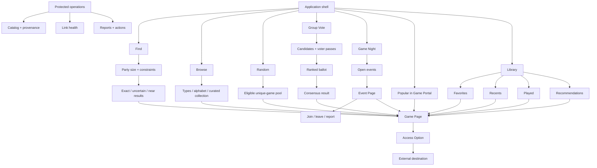

# Game Portal — UX Flows and Information Architecture

## Responsive navigation

### Desktop and laptop

Persistent application rail:

- Find
- Browse
- Random
- Vote
- Game Night
- Popular
- Library / Account

Find-specific party size and active constraints live in a sticky workspace header, not in global navigation.

### Mobile

Bottom navigation:

- Find
- Browse
- Random
- More

`More` contains Vote, Game Night, Popular, Library, Account, privacy, and help. The current route remains visible and keyboard focus follows DOM order.

## Route map

| Route | Purpose | Access |
|---|---|---|
| `/find` | Party-size-first discovery | Public |
| `/browse` | Collection exploration | Public |
| `/games/:slug` | Canonical Game Page | Public |
| `/random` | Uniform draw from active eligibility | Public |
| `/vote/new` | Create candidate set and voter passes | Public host capability or account |
| `/vote/:sessionId` | Submit ballot and see final result | Unguessable capability |
| `/game-nights` | Browse events | Public |
| `/game-nights/new` | Create event | Adult account |
| `/game-nights/:eventId` | Event details and participation | Public summary; capability for joined details |
| `/popular` | Recent internal activity | Public |
| `/library` | Local or account Library | Public/local or account |
| `/account` | Account, export, deletion, recovery | Adult account |
| `/admin/*` | Catalog, sources, link health, reports | Role protected |

## Information architecture



# Core journeys

## Journey 1 — Find for a group in one room

**Trigger:** A group is ready to choose.  
**Goal:** Find a game playable by everyone with current time and equipment.  
**Required:** Party size. Optional: time, age, equipment.

```text
Open Find
→ select party size
→ view exact results
→ add time/equipment if needed
→ inspect result card
→ open Game Page
→ choose physical or shared-screen Access Option
→ play/share/save
```

**Decision points**
- Exact result versus uncertain result.
- Existing equipment versus required equipment.
- Normal teaching time fits versus exceeds available time.

**Recovery**
- No exact result: show blocking constraint and explicit near matches.
- Unknown equipment: classify uncertain, never exact.
- Offline: keep previously built static catalog available; dynamic freshness is labeled stale.

**Guest/account**
- Both complete the journey.
- Guest recents/favorites are local only.
- Account may sync Library.

**Completion signal**
- Game Page opened from an exact result; stronger signal is an explicit outbound access action.

**Minimal analytics**
- `find_started`
- `party_size_selected`
- `filter_changed`
- `result_tier_seen`
- `game_opened`
- `access_intent`

No IP-derived location or birth date is required.

## Journey 2 — Browse the collection

**Trigger:** User wants inspiration rather than immediate filtering.  
**Goal:** Understand what the collection contains.

```text
Open Browse
→ select type or scan alphabetical collection
→ open Game Page
→ optionally apply “works for my group”
→ save/share/play
```

Browse never implies compatibility before constraints are known. A Game Page may invite party-size selection without blocking reading.

## Journey 3 — Find for remote friends

**Required:** Party size, remote mode; optionally devices, account/install tolerance, language, region.

**Critical card statement**
> “Works for 4 remotely · one browser-capable device per person · host account required · checked recently.”

**Recovery**
- An unavailable provider option is replaced by another qualifying Access Option for the same Game when possible.
- If only an unknown-status option remains, the user sees the uncertainty before leaving.

## Journey 4 — Family selection

**Required:** Party size, youngest participant age, time.

**Safety copy**
Age is publisher/editorial guidance, not a guarantee of suitability. The service does not request a child’s birth date or profile.

**Recovery**
Unknown age guidance is uncertain and never exact when the age filter is active.

## Journey 5 — Group Vote

### Host

```text
Create Vote
→ choose catalog games or enter 2–12 candidates
→ set expected voter count
→ review method and partial-ballot rule
→ open and freeze session
→ share one-time voter passes
→ monitor submitted count only
→ close after all submit or host decision
→ view transparent result
```

### Voter

```text
Open voter pass
→ rank all or some candidates
→ review order
→ submit
→ see receipt without ballot disclosure
→ view result after closure
```

**Recovery**
- Lost unused pass: host revokes and reissues.
- Duplicate submission: idempotent receipt.
- Expired/cancelled session: explain state and do not accept changes.
- Tie: display each deterministic step and any secure draw.

## Journey 6 — Random

```text
Open Random
→ choose party size / inherit Find filters
→ see pool size
→ draw uniformly
→ inspect why it qualifies
→ accept or draw again
→ no repeat until exhaustion
```

Avoid reel, roulette, or slot-machine metaphors. Motion is a brief card-shuffle or paper reveal and disappears under reduced motion.

## Journey 7 — Return through Library

Library sections:

- Favorites
- Recently viewed
- Played
- Recommendations

Guest Library is device-local and clearly labeled. Sign-in asks whether to merge local data.

Recommendation example:
> “Because you saved two short remote word games and selected 4 players.”

## Journey 8 — Create or join Game Night

### Host creation

```text
Adult account
→ select Game + Access Option
→ choose remote or in-person public venue
→ enter title, time zone, start, duration, language, age band, capacity
→ review derived requirements
→ acknowledge host rules
→ publish
```

### Participant join

```text
Open public event
→ review game, requirements, age band, conduct rule, seats
→ choose adult/13+ guest OR adult-mediated under-13 participation
→ accept conduct rule
→ claim seat transactionally
→ receive private joined capability
```

**In-person boundary**
- Public venue only.
- No home address.
- Venue information is shown to joined participants and may be public when the venue itself is public.
- The platform does not verify supervision or identity; copy must not imply otherwise.

**Remote boundary**
- Room secret and provider join details appear only after joining.
- No platform chat or attendee directory.

**Recovery states**
- Full, closed, cancelled, expired, removed, unavailable Access Option, join cutoff reached, seat race lost, report submitted.

# Screen-state inventory

| Area | Required states |
|---|---|
| Global | Loading, offline, partial outage, retry, unauthorized, session expired, success |
| Find | Initial, exact, uncertain, no exact, near match, malformed shared URL |
| Browse | Collection, type empty, search no result, offline |
| Game | Complete, partial data, no active option, stale, unavailable, rights-unpublished, embed blocked |
| Vote | Draft, open, partial participation, all submitted, closed, tie, cancelled, expired, revoked pass |
| Random | Ready, drawing, result, no pool, exhausted, invalidated |
| Library | Signed out/local, empty, populated, syncing, merge review, deletion pending |
| Event | Draft, open, full, closed, joined, left, removed, cancelled, completed, expired, reported |
| Popular | Ranked, one-signal/low-sample, no activity, aggregation delayed |
| Operations | Healthy, source delayed, repeated link failure, rights expiry, report escalation |

# Focus and announcement behavior

- Result updates do not move focus.
- A polite live region announces concise counts such as “8 exact games found.”
- Dialogs restore focus to their invoker.
- Reordering a ballot announces candidate and new position.
- Seat updates announce the authoritative count only after the server confirms the transaction.
- Background polling does not repeatedly announce unchanged status.
- Sticky headers and bottom navigation must not obscure focused controls.

# Analytics vocabulary

Events are first-party, pseudonymous, bounded, and documented. Each event records only fields necessary for product decisions.

| Event | Allowed properties |
|---|---|
| `party_size_selected` | selected count |
| `filter_changed` | filter key and normalized non-sensitive value |
| `game_opened` | game ID, source surface, result tier |
| `access_intent` | game ID, Access Option ID, provider ID |
| `random_drawn` | pool size, game ID, draw ordinal |
| `ballot_submitted` | vote session ID, ranked-count only; never candidate order |
| `vote_closed` | candidate count, voter count, tie-step count |
| `favorite_changed` | game ID, add/remove |
| `played_changed` | game ID, add/remove |
| `event_joined` | event ID, mode, remaining seats; no participant name |
| `event_reported` | event ID, category code |
| `popular_opened` | window and displayed sample class |

Raw analytics should be retained briefly, aggregated daily, and excluded from logs where not needed.
